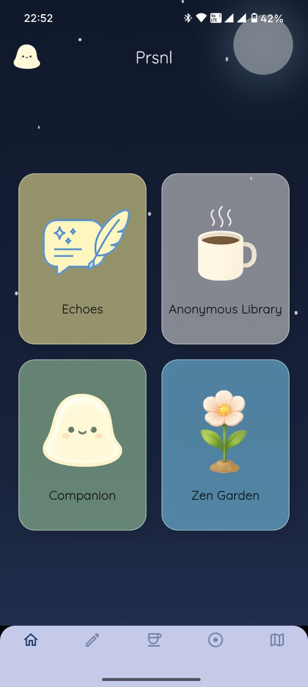
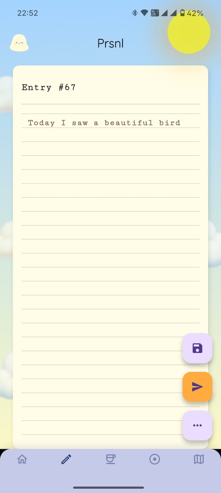
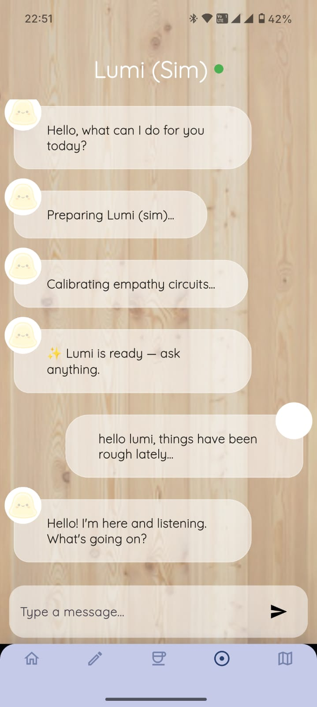
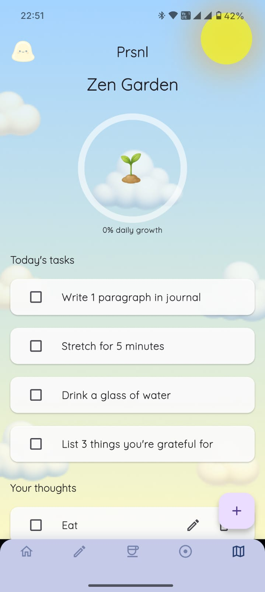

<p align="center">
  
  
  
  
</p>

# PRSNL

> A private space to reflect, express, connect, and grow.

PRSNL is a Flutter-based personal wellness and reflection application designed around the idea that not every thought needs to be shared publicly—and not every difficult moment needs to be faced alone.

The app combines private journaling, anonymous expression, AI-powered conversation, and a visual growth experience within a calm, minimal interface.

## Features

### Journal

A private space for personal thoughts and reflections.

Users can write and revisit journal entries through a distraction-free writing experience designed to feel personal rather than clinical.

### Echoes

A space for anonymous expression and connection.

Users can share thoughts anonymously and explore entries posted by others, creating a sense of shared experience without the pressure of identity-driven social interaction.

### Companion

A conversational companion integrated into the application.

The Companion provides a space for users to talk freely and interact through a conversational interface, complementing the app's reflective experiences.

### Zen Garden

A visual representation of gradual progress and consistency.

The garden evolves through continued interaction, turning personal growth into a calm and tangible visual experience.

### Authentication and Cloud Persistence

PRSNL integrates Firebase services for:

* User authentication
* Cloud-based data storage
* Journal persistence
* Application data management

## Tech Stack

* **Flutter & Dart** — Cross-platform application development
* **Firebase Authentication** — User authentication and session management
* **Cloud Firestore** — Cloud data storage and synchronization
* **flutter_llama** — Local language model integration
* **Custom Flutter UI** — Purpose-built interfaces, animations, and visual components

## Project Structure

```text
lib/
├── auth/          # Authentication services and screens
├── screens/       # Main application screens and feature flows
├── services/      # Firestore and journal data services
├── ui/            # Specialized UI components
├── utils/         # Utility and generation logic
├── widgets/       # Shared widgets
├── main.dart      # Application entry point
└── navbar.dart    # Navigation component
```

## Getting Started

### Prerequisites

Before running the project, ensure that you have:

* Flutter SDK installed
* Dart SDK configured
* Android Studio or another supported Flutter development environment
* A compatible Android emulator or physical device
* Firebase configuration for the required services

### Installation

Clone the repository:

```bash
git clone <repository-url>
cd prsnl_final
```

Install dependencies:

```bash
flutter pub get
```

Run the application:

```bash
flutter run
```

To build a release APK:

```bash
flutter build apk --release
```

## Design Philosophy

PRSNL was designed around four ideas:

**Privacy** — Personal reflection should feel safe and individual.

**Expression** — Users should have multiple ways to process and articulate their thoughts.

**Connection** — Anonymous shared experiences can provide a sense of belonging without the pressures of conventional social media.

**Growth** — Progress does not always need to be measured through numbers, streaks, or performance metrics. Sometimes it can simply be represented by something that grows with you.

## Status

PRSNL is a functional prototype exploring the intersection of personal reflection, anonymous social interaction, conversational AI, and visual progress tracking.

The project continues to serve as an exploration of how technology can support quieter, more personal forms of digital interaction.

## License

This project is intended for educational and portfolio purposes.
